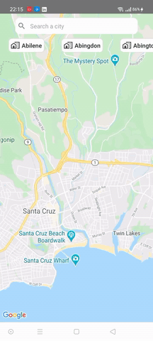
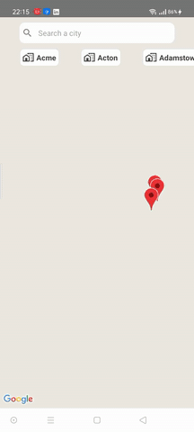
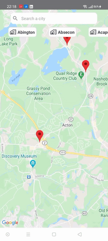
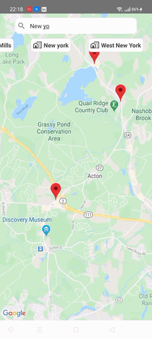

<h1 align="center">Restaurant Map App</h1>


## Table of Contents

- [Overview](#overview)
- [Built With](#built-with)
- [How to use](#how-to-use)
- [Acknowledgements](#acknowledgements)
- [Contact](#contact)

<!-- OVERVIEW -->

## Overview







### Built With


- HTML
- CSS
- [React](https://reactjs.org/)
- [React-Native](https://reactnative.dev/)
- [React-Native-Maps](https://github.com/react-native-maps/react-native-maps)
- [Axios](https://github.com/axios/axios)
- [React-Native-Modal](https://github.com/react-native-modal/react-native-modal)
- [React-Native-Vector-Icons](https://github.com/oblador/react-native-vector-icons)


## How To Use


To clone and run this application, you'll need [Git](https://git-scm.com) and [Node.js](https://nodejs.org/en/download/) (which comes with [npm](http://npmjs.com)) installed on your computer. From your command line:

```bash

$ git clone https://github.com/efemevlut/React-Native-RestaurantMap.git

$ npm install

$ npm install react-native-maps --save-exact

$ npm install axios

$ npm i react-native-modal

$ npm install --save react-native-vector-icons

$ npx react-native run-android

```

## Acknowledgements


- [Node.js](https://nodejs.org/)

## Contact

- GitHub [@your-efemevlut](https://github.com/efemevlut)
- Linkedin [@your-linkedin](https://www.linkedin.com/in/mevl%C3%BCt-efe-5465221b8/)

